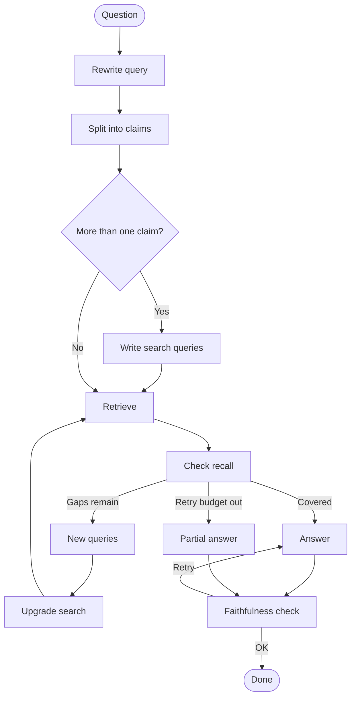

# Citeflow

Citeflow is a **question-answering system over a private document collection**. You ask in natural language; it searches the corpus, checks that the evidence actually covers the question, and only then writes an answer.

Most RAG apps retrieve a few passages and let the model improvise. Citeflow treats answering as a **small workflow**: split the question into claims, gather evidence for each, fill gaps if something is missing, then ground the final wording in those passages. If the collection cannot support a full answer, it says so instead of guessing.

Typical use: research papers, internal docs, or any corpus where **being wrong is worse than being incomplete**.

---

## What you get

- Answers tied to **specific retrieved passages**, not a black-box summary
- **Citations** with source link and page when those exist (e.g. arXiv papers)
- **Tables and figures** from cited chunks in the chat UI, when they were stored at ingest
- A streaming **progress view** so you can see retrieve → check → answer as it runs
- An HTTP API for the same pipeline (batch or streaming)

The default production corpus is **computer-science papers from arXiv**. Ingestion is a separate pipeline (download → layout-aware chunking → embeddings → Qdrant).

---

## How a turn works



1. **Rewrite** the latest message into a standalone question (so follow-ups still search well).
2. **Break it into facts** — the checkable pieces the answer would need.
3. **Search** a hybrid index (semantic vectors + keyword search; optional ColBERT re-ranking).
4. **Recall check** — for each fact, is there enough evidence in what came back?
5. **Repair** — if not, form better queries and search again (budgeted; not an infinite loop).
6. **Answer** using only the catalog of retrieved passages, citing which ones were used.
7. **Faithfulness** — cited ids must be real, and the wording must be supported by those passages. Failures retry; exhaustion yields a partial or last-known answer rather than a silent hallucination.

Multi-turn chat is checkpointed per `session_id`. Scratch from one question (facts, retrieved set) does not leak into the next.

---

## Evaluation

Offline runs on HotpotQA (distractor split). Fill in after the next benchmark. Graph mode (`--mode graph`) writes all five columns below. Retrieval-only runs fill latency and leave the quality columns blank.

| Setup | Faithfulness | Answer correctness | Partial answers | Mean latency (seconds) | p50 latency (seconds) |
|-------|--------------|--------------------|-----------------|------------------------|------------------------|
| Hybrid search | — | — | — | — | — |
| Hybrid search + rerank | — | — | — | — | — |
| Full Citeflow pipeline | — | — | — | — | — |

How to run: [benchmarking/hotpotqa/README.md](benchmarking/hotpotqa/README.md).

---

## Quick start

```bash
python3 -m venv .venv && source .venv/bin/activate
pip install -r requirements.txt
cp .env.example .env   # OpenAI + Qdrant keys, collection name
uvicorn api.main:app --reload
```

```bash
curl -X POST http://127.0.0.1:8000/run \
  -H "Content-Type: application/json" \
  -d '{"session_id":"demo","message":"What does the Transformer paper say about attention?"}'
```

Chat UI: `python ui/dash_app.py` (port 8050). Streamed progress: `POST /run/stream`.

Load a corpus first (arXiv PDFs → Qdrant): [ingestion/README.md](ingestion/README.md).

---

## Stack

| Piece | Role |
|-------|------|
| [LangGraph](https://github.com/langchain-ai/langgraph) | Orchestrates the steps above |
| [Qdrant](https://qdrant.tech/) | Vector + keyword (+ optional ColBERT) search |
| OpenAI | Embeddings and the per-step language models |
| Jina (optional) | ColBERT-style re-ranking |
| FastAPI + Dash | API and chat UI |
| Langfuse (optional) | Tracing |
| RAGAS | Offline recall, faithfulness, and answer-correctness scoring |

Python 3.10+. MIT license.

---

## Repository map

| Path | What it is |
|------|------------|
| `graph/` | The agent workflow |
| `retriever/` | Qdrant search |
| `ingestion/` | Papers → chunks → index |
| `api/` · `ui/` | Service and chat |
| `benchmarking/hotpotqa/` | Offline eval |
| `prompts/` · `output_validation/` | Node instructions and structured outputs |

Configuration lives in `.env` (see `.env.example`). Tests: `make test`. Local API + UI: `./start.sh`.

More for contributors: [CONTRIBUTING.md](CONTRIBUTING.md).
