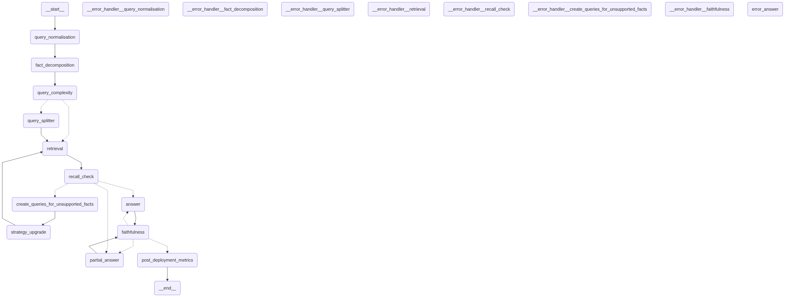

# Factline

Fact-first RAG orchestration on **LangGraph**, **Qdrant**, and **OpenAI**.

Factline does not retrieve-and-hope. Each turn decomposes the question into checkable facts, retrieves evidence, verifies whether those facts are supported, repairs gaps when needed, then answers only from grounded passages — with a faithfulness gate before the response is finalized.

---

## Features

- Explicit multi-node graph: normalize → decompose → retrieve → recall check → repair → answer → faithfulness
- Hybrid retrieval: dense + BM25, optional ColBERT late interaction (Jina)
- Turn-local `document_catalog` (point id → text / score / source URL / page) accumulated across repair passes
- Cited-id validation + LLM faithfulness before shipping answers
- FastAPI (`/run`, `/run/stream`) and optional Dash UI
- HotpotQA offline benchmarks (retrieval and full graph)
- Optional Langfuse tracing (including end-of-turn metrics on the root span)

---

## Architecture



1. **Normalize** the user message into a standalone query  
2. **Decompose** into ordered facts (`fact_id`, verification shell)  
3. **Route** — single fact retrieves with the normalized query; multiple facts split into focused queries  
4. **Retrieve** via Qdrant hybrid search; repair passes exclude already-seen point ids  
5. **Verify recall** — one batched LLM call over all facts against the catalog  
6. **Repair** unsupported facts (gap-fill queries → strategy upgrade → retrieve) until the retry budget is exhausted  
7. **Answer** or **partial answer** with `cited_document_ids` from `document_catalog`  
8. **Faithfulness** — cited ids must exist in the catalog, then LLM grounding (retry up to `ANSWER_RETRY_MAX`)  
9. **Post-deployment metrics** — optional Langfuse turn snapshot (hidden from UI)

---

## Benchmark results (HotpotQA)

Evaluated on **50** HotpotQA distractor-split questions. The corpus was uploaded with large language model enrichment into the Qdrant collection `hotpot_with_enrichment` (`RETRIEVAL_TOP_K=5`). Quality scores are RAGAS means on a 0–1 scale. Latency is end-to-end wall-clock time per question in seconds (mean, 50th percentile, and 99th percentile).

| Evaluation mode | Context precision | Context recall | Faithfulness | Answer correctness | Partial answers | Mean latency (seconds) | p50 latency (seconds) | p99 latency (seconds) |
|-----------------|------------------:|---------------:|-------------:|-------------------:|----------------:|-----------------------:|----------------------:|----------------------:|
| Dense embedding + BM25 | 0.47 | 0.70 | Not applicable | Not applicable | Not applicable | 0.66 | 0.62 | 2.39 |
| Dense embedding + BM25 + late interaction | 0.51 | 0.80 | Not applicable | Not applicable | Not applicable | 3.28 | 1.42 | 15.70 |
| Full Factline graph | 0.47 | 0.82 | 0.78 | 0.60 | 10 / 50 (20%) | 22.68 | 15.87 | 64.68 |

**Notes**

- Retrieval-only modes report context precision and context recall only.  
- Full Factline graph mode also reports faithfulness and answer correctness; partial answers are included when scorable.  
- Late interaction improves context recall versus dense embedding + BM25 alone, at higher latency.  
- Full Factline graph adds multi-step large language model orchestration (highest latency; includes answer-level metrics).

Raw result artifacts: `benchmarking/hotpotqa/data/results/` (see [benchmarking/hotpotqa/README.md](benchmarking/hotpotqa/README.md)).

---

## Quick start

```bash
python3 -m venv .venv && source .venv/bin/activate
pip install -r requirements.txt
cp .env.example .env   # set OPENAI_API_KEY, QDRANT_URL, QDRANT_API_KEY, QDRANT_COLLECTION_NAME
uvicorn api.main:app --reload
```

```bash
curl -X POST http://127.0.0.1:8000/run \
  -H "Content-Type: application/json" \
  -d '{"session_id":"demo","message":"Compare refund policies for Enterprise and Consumer tiers."}'
```

Stream progress (SSE):

```bash
curl -N -X POST http://127.0.0.1:8000/run/stream \
  -H "Content-Type: application/json" \
  -d '{"session_id":"demo","message":"Compare refund policies for Enterprise and Consumer tiers."}'
```

Optional UI: `python ui/dash_app.py` (port 8050).

---

## Configuration

Copy `.env.example` → `.env`. Main groups:

| Group | Variables |
|-------|-----------|
| OpenAI | `OPENAI_API_KEY`, `OPENAI_EMBEDDING_MODEL`, `OPENAI_EMBEDDING_DIMENSIONS` |
| Qdrant | `QDRANT_URL`, `QDRANT_API_KEY`, `QDRANT_COLLECTION_NAME` |
| Retrieval | `USE_BM25`, `USE_LATE_INTERACTION`, `DENSE_PQ` (`none` / `pq8` / `pq16` / `pq32`; ingest+app must match), `RETRIEVAL_TOP_K`, candidate pool sizes, `RETRIEVAL_MMR_DIVERSITY` |
| Repair | `RETRIEVAL_LOOP_MAX_RETRIES`, `ANSWER_RETRY_MAX` |
| Node retries | `GRAPH_NODE_RETRY_MAX_ATTEMPTS` |
| Models | `QUERY_NORMALISATION_MODEL`, `QUERY_DECOMPOSITION_MODEL`, `RECALL_CHECK_MODEL`, `GAP_FILL_MODEL`, `FINAL_ANSWER_MODEL`, `FAITHFULNESS_MODEL` |
| Observability | `LANGFUSE_TRACING_ENABLED` (+ Langfuse keys when true) |

HotpotQA-only knobs live in `benchmarking/hotpotqa/.env` (`HOTPOTQA_MAX_QUESTIONS`, `HOTPOTQA_RAGAS_MODEL`).

---

## Document catalog & payload contract

Retriever hits keep the full Qdrant payload. The graph stores a slim catalog:

```text
point_id → { text, score, source, page_number }
```

- `text` = `additional_metadata.raw_text` (grounding / RAGAS / answer citations)  
- `source` = arXiv abs URL (UI only, cited chunks)  
- `page_number` = Unstructured PDF page (UI only, cited chunks)  
- Answer LLMs see `{text, score}` keyed by point id and must return those ids in `cited_document_ids`  
- Embedding string may be enriched at upload; LLMs answer from **raw** text only  

```json
{
  "text": "string used for dense / BM25 / ColBERT at upload",
  "enrichments": {},
  "additional_metadata": {
    "raw_text": "original passage",
    "source": "https://arxiv.org/abs/1706.03762",
    "page_number": 3,
    "filename": "arxiv_1706.03762.pdf",
    "arxiv_id": "1706.03762"
  }
}
```

Production arXiv ingestion: [ingestion/README.md](ingestion/README.md). Collection: `arxiv_cs_ds`.

---

## API

| Endpoint | Description |
|----------|-------------|
| `POST /run` | One turn → answer, sources, confidence, cited ids, document catalog |
| `POST /run/stream` | SSE node progress; final frame when `faithfulness_ok` |
| `POST /resume` | Reserved for clarification interrupts |

`sources` are the cited catalog point ids after faithfulness (LLM leaves `sources: []`). Turn scratch, including `document_catalog`, resets at the next `/run`.

---

## Project layout

| Path | Role |
|------|------|
| `graph/` | LangGraph state, nodes, routing |
| `retriever/` | Qdrant hybrid retrieval |
| `prompts/` | System prompts per LLM node |
| `output_validation/` | Pydantic structured-output schemas |
| `api/` | FastAPI app |
| `ui/` | Dash chat client |
| `ingestion/` | arXiv download → chunk → embed → Qdrant (`arxiv_cs_ds`) |
| `benchmarking/hotpotqa/` | HotpotQA download, upload, eval |
| `artifacts/` | Graph topology (`langgraph.png`) |

---

## Observability

With `LANGFUSE_TRACING_ENABLED=true`, each `/run` or `/run/stream` opens a root span with nested node and generation spans. `post_deployment_metrics` writes a turn snapshot onto the root span output (not shown in the UI progress stream).

---

## Stack

LangGraph · Qdrant · OpenAI · Jina ColBERT (optional) · Langfuse (optional) · RAGAS (benchmarks)

---

## Contributing

See [CONTRIBUTING.md](CONTRIBUTING.md). Short notes:

```bash
make install
make test
./start.sh    # or: make start
./stop.sh     # or: make stop
```

---

## License

MIT — see [LICENSE](LICENSE).
