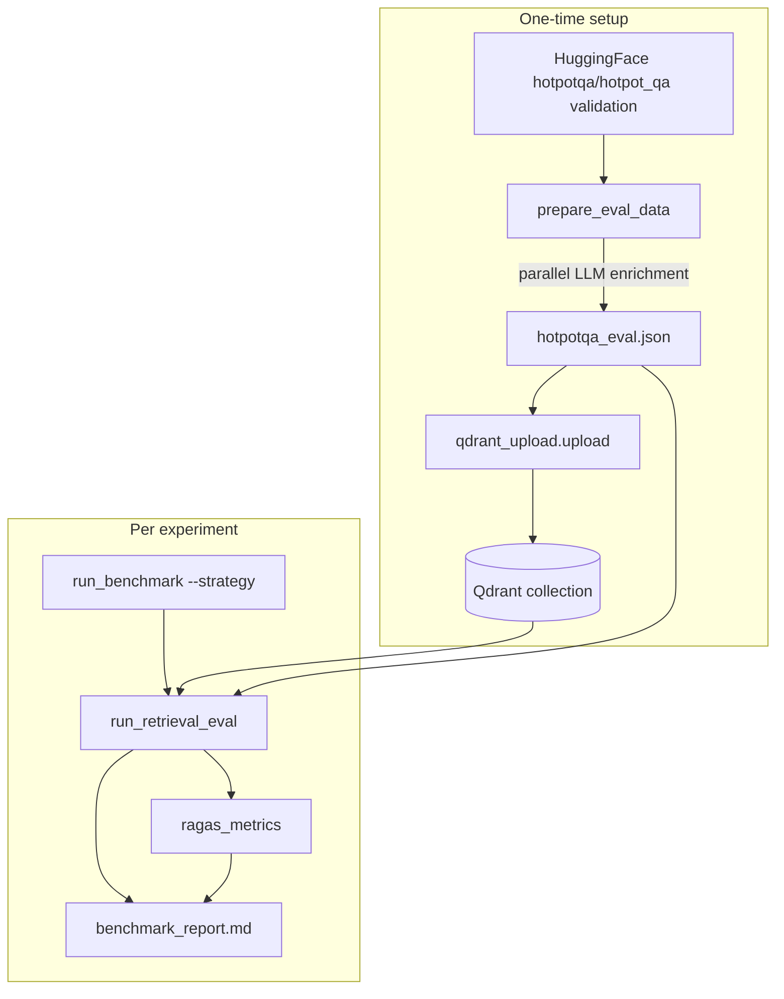

# HotpotQA Retriever Benchmark

Local **retriever-only** benchmark for HotpotQA fullwiki validation. Questions go directly to `Retriever.retrieve()` — the LangGraph agent is not used.

## Overview

| `--strategy` value | Behavior |
|--------------------|----------|
| `fast_retrieval` | Dense (+ optional MMR at query time) |
| `keyword` | BM25-only |
| `fast_bm25_retrieval` | Dense + BM25 + RRF |
| `fast_bm25_late_interaction_retrieval` | Hybrid + ColBERT re-rank (Jina) |

These strings are identical to the graph and [`retriever/retriever.py`](../../retriever/retriever.py). The production graph picks strategy per turn; this benchmark **fixes one tier per run** for ablation.

**Retrieval scope (fullwiki):** Each question searches the **entire Qdrant collection** built at upload time (paragraphs from every question in `hotpotqa_eval.json`), not only that question’s Wikipedia contexts. This matches HotpotQA fullwiki-style evaluation.

**Metrics:**

- **RAGAS** (vanilla): `ContextPrecision`, `ContextRecall` from `ragas.metrics.collections` — no custom prompts or wrappers.
- **Retriever latency**: wall-clock of `Retriever.retrieve()` only — not RAGAS scoring time.

`reference_context_ids`, `reference_contexts`, and `retrieved_context_ids` are stored for debugging; they are **not** used for ID-based scoring (no recall@K / MRR in this benchmark).

## Prerequisites

- Python dependencies from repo root `requirements.txt` (`datasets`, `ragas`, `qdrant-client`, etc.).
- RAGAS scores depend on your installed `ragas` version.

### Environment setup

```bash
cp benchmarking/hotpotqa/.env.example benchmarking/hotpotqa/.env
# Edit benchmarking/hotpotqa/.env — do NOT use the repo root .env
```

| Strategy | Required env (at run time) |
|----------|----------------------------|
| `fast_retrieval` | `OPENAI_API_KEY`, Qdrant |
| `keyword` | `USE_BM25=true` |
| `fast_bm25_retrieval` | `USE_BM25=true` |
| `fast_bm25_late_interaction_retrieval` | `USE_BM25=true`, `USE_LATE_INTERACTION=true`, `JINA_API_KEY` |

### `USE_BM25`, `USE_LATE_INTERACTION`, `USE_MMR` (upload vs retrieval)

Keep these aligned between **upload** and the **`--strategy`** you benchmark.

| Flag | Upload (`qdrant_upload`) | Retrieval (`run_benchmark`) |
|------|--------------------------|-----------------------------|
| `USE_BM25=true` | Sparse index + BM25 document vector on each point | Required for `keyword`, `fast_bm25_retrieval`, `fast_bm25_late_interaction_retrieval` |
| `USE_LATE_INTERACTION=true` | ColBERT multivector on each point (Jina document embed) | Required for `fast_bm25_late_interaction_retrieval` |
| `USE_MMR=true` | Not used | Optional diversification on dense query path (`fast_retrieval` and hybrid dense prefetches) |

Dense embeddings are always uploaded. If upload used `USE_BM25=false` but you run `--strategy keyword`, sparse vectors will be missing.

**Upload behavior:** Each run of `qdrant_upload.upload` replaces the target collection entirely (delete if exists → create → upsert). The index always matches the current `hotpotqa_eval.json` with no leftover points from older runs.

## Pipeline



## Quick start

```bash
# From repo root
cp benchmarking/hotpotqa/.env.example benchmarking/hotpotqa/.env
# Fill OPENAI_API_KEY, QDRANT_*, JINA_API_KEY (if needed)

python -m benchmarking.hotpotqa.dataset.prepare_eval_data
python -m benchmarking.hotpotqa.qdrant_upload.upload

export HOTPOTQA_EXPERIMENT_NAME=hotpot_fast_retrieval
python -m benchmarking.hotpotqa.run_benchmark --strategy fast_retrieval
```

Repeat with different `HOTPOTQA_EXPERIMENT_NAME` and `--strategy` values:

```bash
python -m benchmarking.hotpotqa.run_benchmark --strategy keyword
python -m benchmarking.hotpotqa.run_benchmark --strategy fast_bm25_retrieval
python -m benchmarking.hotpotqa.run_benchmark --strategy fast_bm25_late_interaction_retrieval
```

Dev shortcut (skip RAGAS):

```bash
python -m benchmarking.hotpotqa.run_benchmark --strategy fast_retrieval --skip-ragas
```

`--skip-ragas` still runs retrieval and writes `benchmark_report.md`; the RAGAS section will note missing `ragas_results.json`.

## Step-by-step scripts

| Step | Command | What it does | Output |
|------|---------|--------------|--------|
| 1 | `python -m benchmarking.hotpotqa.dataset.prepare_eval_data` | Loads HF validation, subsamples, joins sentences into `text`, **LLM-enriches each context** | `data/processed/hotpotqa_eval.json` |
| 2 | `python -m benchmarking.hotpotqa.qdrant_upload.upload` | **Deletes** `QDRANT_COLLECTION_NAME` if it exists, recreates it, embeds prefixed text, upserts | Fresh points in `QDRANT_COLLECTION_NAME` |
| 3 | `python -m benchmarking.hotpotqa.run_benchmark --strategy <literal>` | Retrieve → RAGAS → report | `data/results/{experiment}/` |

### `HOTPOTQA_MAX_QUESTIONS` (where it applies)

| Step | Uses `HOTPOTQA_MAX_QUESTIONS`? |
|------|-------------------------------|
| `prepare_eval_data` | **Yes** — stratified subsample (seed 42) by `type` × `level`, then writes JSON |
| `qdrant_upload` | **No** — uploads **all** records in `hotpotqa_eval.json` |
| `run_retrieval_eval` / `ragas_metrics` | **Yes** — caps rows to first N in JSON (safety if JSON is larger than intended) |

After changing `HOTPOTQA_MAX_QUESTIONS`, re-run **prepare**, then **upload** (upload always rebuilds the collection from the current JSON).

### Context enrichment (prepare step)

For each context, `text` is all non-empty `sentences` joined with spaces. Prepare then calls the LLM once per context (~5k calls for 500 questions × ~10 contexts) using `HOTPOTQA_CONTEXT_ENRICHMENT_MODEL` (default `gpt-4o-mini`), parallelized with `HOTPOTQA_ENRICHMENT_CONCURRENCY`.

**Enrichment JSON** (stored on each context):

```json
{
  "predicted_title": "...",
  "summary": "two lines",
  "keywords": ["entities", "dates", "other terms"],
  "facts": [{ "fact": "checkable need", "fact_question": "searchable query" }]
}
```

- `predicted_title` is for analysis only — **not** used in embedding prefix.
- `keywords`: named entities plus other high-signal retrieval terms.
- On failure after `HOTPOTQA_ENRICHMENT_MAX_RETRIES`, `enrichment` is `null`; upload embeds raw `text` only.

**Upload embedding prefix** (`build_embedding_text`) — same string for dense, BM25, and ColBERT:

```text
Title:
{gold HotpotQA title}

Summary:
{summary}

Present Facts:
- {fact}

Sample Query Questions:
- {fact_question}

Keywords:
{comma-separated keywords}

Passage:
{text}
```

Re-running prepare always re-enriches; re-run upload after prepare to refresh vectors.

### Step 3 breakdown (debugging)

| Module | Output |
|--------|--------|
| `evaluation.run_retrieval_eval` | `retrieval_results.json`, `run_metadata.json` |
| `metrics.ragas_metrics` | `ragas_results.json`, optional `type_level_metrics.xlsx` |
| `metrics.build_report` | `benchmark_report.md` (includes RAGAS means + optional type/level breakdown) |

Standalone steps (each needs prior artifacts):

```bash
python -m benchmarking.hotpotqa.evaluation.run_retrieval_eval --strategy fast_bm25_retrieval
python -m benchmarking.hotpotqa.metrics.ragas_metrics
python -m benchmarking.hotpotqa.metrics.build_report
```

## Environment variables

See [`.env.example`](.env.example) for the **standalone** template (copy to `benchmarking/hotpotqa/.env` only — do not use repo root `.env`). Groups:

- **OpenAI**: `OPENAI_API_KEY`, `OPENAI_EMBEDDING_*`, `OPENAI_TEMPERATURE`
- **Context enrichment**: `HOTPOTQA_CONTEXT_ENRICHMENT_MODEL`, `HOTPOTQA_ENRICHMENT_CONCURRENCY`, `HOTPOTQA_ENRICHMENT_MAX_RETRIES`
- **RAGAS**: `HOTPOTQA_RAGAS_MODEL`
- **Qdrant**: `QDRANT_URL`, `QDRANT_API_KEY`, `QDRANT_COLLECTION_NAME`, vector names
- **Retrieval flags**: `USE_BM25`, `USE_LATE_INTERACTION`, `USE_MMR` (see table above)
- **Retrieval tuning**: `RETRIEVAL_TOP_K`, `RETRIEVAL_CANDIDATE_DENSE_MMR`, `RETRIEVAL_CANDIDATE_BM25`, `RETRIEVAL_CANDIDATE_FOR_LATE_INTERACTION`, `RETRIEVAL_MMR_DIVERSITY`, `REQUEST_TIMEOUT_SECONDS` (no repair-loop `_MAX` vars)
- **Jina**: required for `fast_bm25_late_interaction_retrieval` at upload and retrieval
- **Dataset**: `HOTPOTQA_MAX_QUESTIONS`, `HOTPOTQA_UPLOAD_BATCH_SIZE`, `HOTPOTQA_DATASET_*`, `HOTPOTQA_SPLIT`
- **Experiment**: `HOTPOTQA_EXPERIMENT_NAME` → `data/results/{name}/`
- **Rate limiting**: `OPENAI_RATE_LIMIT_*`
- **Langfuse** (optional): `LANGFUSE_TRACING_ENABLED`, keys, host

CLI overrides: `--experiment-name` on `run_benchmark`; `--skip-ragas` to skip RAGAS only.

## Metrics glossary

### RAGAS

Stock `ContextPrecision` and `ContextRecall` from `ragas.metrics.collections`, using:

- `user_input` = question  
- `reference` = `reference_answer` (HotpotQA gold short answer)  
- `retrieved_contexts` = passage texts returned by the retriever  

Judged via `HOTPOTQA_RAGAS_MODEL` and `AsyncOpenAI` (vanilla `llm_factory` wiring). Rows with empty `retrieved_contexts` are skipped.

### Retriever latency

`retrieval_latency_ms` per question — time inside `Retriever.retrieve()` only. Aggregates (mean, p50, p95, min, max) in `run_metadata.json` and the **Retriever latency** section of `benchmark_report.md`.

### Reference fields (not RAGAS-scored as ID metrics)

- `reference_contexts` / `reference_context_ids`: gold **supporting** paragraphs from HotpotQA (`is_supporting: true` in the eval JSON).
- `retrieved_*`: what Qdrant returned for the query (may include non-supporting paragraphs from other articles in the collection).

## Artifacts

```text
benchmarking/hotpotqa/
  data/processed/hotpotqa_eval.json
  data/results/{HOTPOTQA_EXPERIMENT_NAME}/
    retrieval_results.json
    run_metadata.json
    ragas_results.json
    type_level_metrics.xlsx   # optional, from ragas_metrics
    benchmark_report.md       # summary, RAGAS, latency, type/level breakdown
```

`benchmark_report.md` sections: run summary, RAGAS table, retriever latency, breakdown by HotpotQA `type` and `level` (when RAGAS ran), artifact paths.

### Retrieval result row (sample)

```json
{
  "id": "...",
  "question": "...",
  "type": "comparison",
  "level": "hard",
  "reference_answer": "...",
  "reference_contexts": ["..."],
  "reference_context_ids": ["question_id:2"],
  "retrieval_strategy": "fast_bm25_retrieval",
  "retrieval_latency_ms": 312.5,
  "retrieved_contexts": ["..."],
  "retrieved_context_ids": ["question_id:2", "other_id:0"],
  "retrieved_docs": [
    {
      "id": "uuid",
      "score": 21.6,
      "rank": 1,
      "payload": { "context_id": "...", "text": "...", "is_supporting": true }
    }
  ]
}
```

## Dataset

- Source: `hotpotqa/hotpot_qa`, config `fullwiki`, split `validation` (has answers and supporting facts; official test split is not used for local scoring).
- `prepare_eval_data` downloads/loads the **full validation split** from Hugging Face (cached locally after first run), then optionally keeps `HOTPOTQA_MAX_QUESTIONS` rows via stratified sampling (seed 42).
- Each record includes all paragraph `contexts` for that question; upload indexes **all** non-empty paragraphs into one shared collection.

## Troubleshooting

- **Re-upload**: running `qdrant_upload.upload` again **deletes** the collection named in `QDRANT_COLLECTION_NAME` (if present) and ingests from the current `hotpotqa_eval.json` — no manual delete needed. Use a dedicated benchmark collection name so you do not wipe unrelated data.
- **Flag / schema changes**: after changing embedding dimensions or `USE_BM25` / `USE_LATE_INTERACTION`, re-run **upload** so the collection is recreated with the right config.
- **Flag mismatch**: set upload flags to match the `--strategy` you plan to benchmark (`USE_BM25` for `keyword`, etc.).
- **`fast_bm25_late_interaction_retrieval`**: needs `JINA_API_KEY` and `USE_LATE_INTERACTION=true` at upload and retrieval.
- **Empty RAGAS rows**: skipped when `retrieved_contexts` is empty (count in `ragas_results.json` summary).
- **Stale results**: old `at_k_metrics.json` / `exact_metrics.json` under `data/results/` are from prior tooling and are ignored.
- Compare strategies: run four experiments with different `HOTPOTQA_EXPERIMENT_NAME` values and diff `benchmark_report.md` files.

## Comparing strategies

```bash
HOTPOTQA_EXPERIMENT_NAME=hotpot_fast_retrieval python -m benchmarking.hotpotqa.run_benchmark --strategy fast_retrieval
HOTPOTQA_EXPERIMENT_NAME=hotpot_keyword python -m benchmarking.hotpotqa.run_benchmark --strategy keyword
HOTPOTQA_EXPERIMENT_NAME=hotpot_fast_bm25 python -m benchmarking.hotpotqa.run_benchmark --strategy fast_bm25_retrieval
HOTPOTQA_EXPERIMENT_NAME=hotpot_fast_bm25_late python -m benchmarking.hotpotqa.run_benchmark --strategy fast_bm25_late_interaction_retrieval
```

Or: `python -m benchmarking.hotpotqa.run_benchmark --strategy fast_retrieval --experiment-name hotpot_fast_retrieval`
