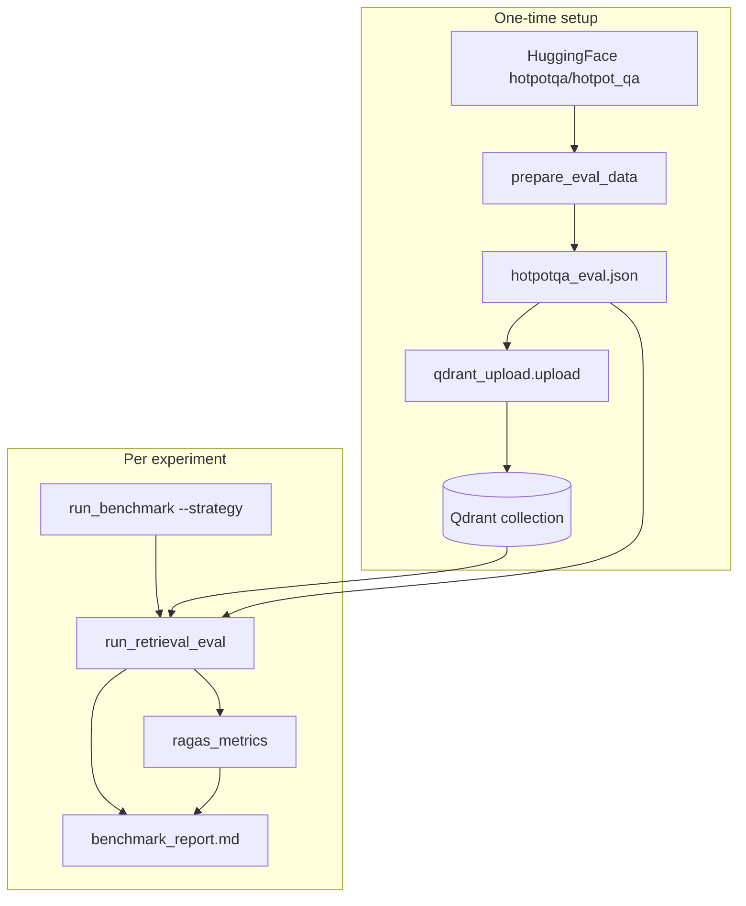

# HotpotQA Retriever Benchmark

Local **retriever-only** benchmark for HotpotQA fullwiki validation. Questions go directly to `Retriever.retrieve()` — the LangGraph agent is not used.

## Overview

| `--strategy` value | Behavior |
|--------------------|----------|
| `fast_retrieval` | Dense (+ optional MMR) |
| `keyword` | BM25-only |
| `fast_bm25_retrieval` | Dense + BM25 + RRF |
| `fast_bm25_late_interaction_retrieval` | Hybrid + ColBERT re-rank (Jina) |

These strings are identical to the graph and [`retriever/retriever.py`](../../retriever/retriever.py). The production graph picks strategy per turn; this benchmark **fixes one tier per run** for ablation.

**Metrics:**

- **RAGAS** (vanilla): `ContextPrecision`, `ContextRecall` — no custom prompts or wrappers.
- **Retriever latency**: wall-clock of `Retriever.retrieve()` only — not RAGAS scoring time.

Context ids in `retrieval_results.json` are kept for debugging only; they are not scored with ID-based metrics.

## Prerequisites

- Python dependencies from repo root `requirements.txt` (`datasets`, `ragas`, `qdrant-client`, etc.).
- RAGAS scores depend on your installed `ragas` version.

### Environment setup

```bash
cp benchmarking/hotpotqa/.env.example benchmarking/hotpotqa/.env
# Edit benchmarking/hotpotqa/.env — do NOT use the repo root .env
```

| Strategy | Required env |
|----------|----------------|
| `fast_retrieval` | `OPENAI_API_KEY`, Qdrant |
| `keyword` | `USE_BM25=true` |
| `fast_bm25_retrieval` | `USE_BM25=true` |
| `fast_bm25_late_interaction_retrieval` | `USE_BM25=true`, `USE_LATE_INTERACTION=true`, `JINA_API_KEY` |

## Pipeline



## Quick start

```bash
# From repo root
cp benchmarking/hotpotqa/.env.example benchmarking/hotpotqa/.env
# Fill OPENAI_API_KEY, QDRANT_*, JINA_API_KEY (if needed)

python -m benchmarking.hotpotqa.dataset.prepare_eval_data
python -m benchmarking.hotpotqa.qdrant_upload.upload

export HOTPOTQA_EXPERIMENT_NAME=hotpot_fast_retrieval
python -m benchmarking.hotpotqa.run_benchmark --strategy fast_retrieval
```

Repeat with different `HOTPOTQA_EXPERIMENT_NAME` and `--strategy` values:

```bash
python -m benchmarking.hotpotqa.run_benchmark --strategy keyword
python -m benchmarking.hotpotqa.run_benchmark --strategy fast_bm25_retrieval
python -m benchmarking.hotpotqa.run_benchmark --strategy fast_bm25_late_interaction_retrieval
```

Dev shortcut (skip RAGAS):

```bash
python -m benchmarking.hotpotqa.run_benchmark --strategy fast_retrieval --skip-ragas
```

## Step-by-step scripts

| Step | Command | Output |
|------|---------|--------|
| 1 | `python -m benchmarking.hotpotqa.dataset.prepare_eval_data` | `data/processed/hotpotqa_eval.json` |
| 2 | `python -m benchmarking.hotpotqa.qdrant_upload.upload` | Qdrant collection (created if missing) |
| 3 | `python -m benchmarking.hotpotqa.run_benchmark --strategy <literal>` | `data/results/{experiment}/` |

### Step 3 breakdown (debugging)

| Module | Output |
|--------|--------|
| `evaluation.run_retrieval_eval` | `retrieval_results.json`, `run_metadata.json` |
| `metrics.ragas_metrics` | `ragas_results.json`, optional `type_level_metrics.xlsx` |
| `metrics.build_report` | `benchmark_report.md` |

Example standalone retrieval:

```bash
python -m benchmarking.hotpotqa.evaluation.run_retrieval_eval --strategy fast_bm25_retrieval
```

## Environment variables

See [`.env.example`](.env.example) for the full template. Groups:

- **OpenAI**: `OPENAI_API_KEY`, `OPENAI_EMBEDDING_*`, `HOTPOTQA_RAGAS_MODEL`
- **Qdrant**: `QDRANT_URL`, `QDRANT_API_KEY`, `QDRANT_COLLECTION_NAME`, vector names
- **Retrieval**: `USE_BM25`, `USE_LATE_INTERACTION`, `USE_MMR`, `RETRIEVAL_TOP_K`, `RETRIEVAL_CANDIDATE_LIMIT`
- **Jina**: required for `fast_bm25_late_interaction_retrieval`
- **Dataset**: `HOTPOTQA_MAX_QUESTIONS` (500 default, stratified seed 42), `HOTPOTQA_UPLOAD_BATCH_SIZE`
- **Experiment**: `HOTPOTQA_EXPERIMENT_NAME` → `data/results/{name}/`

## Metrics glossary

### RAGAS

Stock `ContextPrecision` and `ContextRecall` from `ragas.metrics.collections`, judged against `reference_answer` and `retrieved_contexts`. No custom metrics or prompt overrides.

### Retriever latency

`retrieval_latency_ms` per question in `retrieval_results.json`; aggregates in `run_metadata.json` and `benchmark_report.md`.

## Artifacts

```text
benchmarking/hotpotqa/
  data/processed/hotpotqa_eval.json
  data/results/{HOTPOTQA_EXPERIMENT_NAME}/
    retrieval_results.json
    run_metadata.json
    ragas_results.json
    type_level_metrics.xlsx   # optional
    benchmark_report.md
```

### Retrieval result row (sample)

```json
{
  "id": "...",
  "question": "...",
  "reference_answer": "...",
  "retrieval_strategy": "fast_bm25_retrieval",
  "retrieval_latency_ms": 312.5,
  "reference_context_ids": ["..."],
  "retrieved_context_ids": ["..."],
  "retrieved_contexts": ["..."],
  "retrieved_docs": []
}
```

## Dataset

- Source: `hotpotqa/hotpot_qa`, config `fullwiki`, split `validation`
- Validation split includes answers and supporting facts (not official test).
- With `HOTPOTQA_MAX_QUESTIONS > 0`, stratified subsample (seed 42) balances `type` × `level`.

## Troubleshooting

- **Re-index** after changing embedding model or dimensions (delete Qdrant collection manually; upload does not recreate existing collections).
- **`fast_bm25_late_interaction_retrieval`**: needs `JINA_API_KEY` and `USE_LATE_INTERACTION=true`.
- **Empty RAGAS rows**: skipped when `retrieved_contexts` is empty (logged in summary).
- Compare strategies: run four experiments and diff `benchmark_report.md` files.

## Comparing strategies

```bash
HOTPOTQA_EXPERIMENT_NAME=hotpot_fast_retrieval python -m benchmarking.hotpotqa.run_benchmark --strategy fast_retrieval
HOTPOTQA_EXPERIMENT_NAME=hotpot_keyword python -m benchmarking.hotpotqa.run_benchmark --strategy keyword
HOTPOTQA_EXPERIMENT_NAME=hotpot_fast_bm25 python -m benchmarking.hotpotqa.run_benchmark --strategy fast_bm25_retrieval
HOTPOTQA_EXPERIMENT_NAME=hotpot_fast_bm25_late python -m benchmarking.hotpotqa.run_benchmark --strategy fast_bm25_late_interaction_retrieval
```

Or pass `--experiment-name` on each run.
