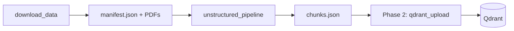

# Ingestion (PMC → Qdrant)

Self-contained production ingestion for Factline. Configure via **`ingestion/.env`** only — not the repo root or benchmark env.

```bash
cp ingestion/.env.example ingestion/.env
```

**Isolation:** nothing outside `ingestion/` imports this package. Ingestion does not import graph, retriever, API, or benchmark code.

---

## Pipeline



| Step | Module | Status | Output |
|------|--------|--------|--------|
| 1. Download | `download_data.py` | Done | `raw_pdfs/PMC_*.pdf`, `manifest.json` |
| 2. Partition + chunk | `unstructured_pipeline.py` | Done | `raw_pdfs/chunks.json` |
| 3. Embed + upsert | `qdrant_upload.py` | Phase 2 | Qdrant points |

---

## Quick start

```bash
# 1. Config
cp ingestion/.env.example ingestion/.env
# Set UNSTRUCTURED_API_KEY for step 2; Qdrant/OpenAI/Jina for step 3

# 2. Download PMC PDFs
python -m ingestion.download_data --max-results 150

# 3. Partition + chunk (Unstructured Jobs API)
python -m ingestion.unstructured_pipeline

# 4. Embed + upsert (Phase 2 — when wired)
python -m ingestion.qdrant_upload
```

Dry-run batching without API calls:

```bash
python -m ingestion.unstructured_pipeline --dry-run
```

---

## Step 1 — Download

```bash
python -m ingestion.download_data --max-results 150
python -m ingestion.download_data \
  --query "semaglutide AND open access[filter]" \
  --max-results 20
```

Writes `ingestion/raw_pdfs/manifest.json` with per-paper `status` (`downloaded`, `skipped`, `failed`).

---

## Step 2 — Unstructured partition + chunk

Uses the **On-Demand Jobs API** (`POST /api/v1/jobs/`).

### Job DAG


Configured from env — see `ingestion/.env.example`.

### Job limits

| Limit | Value |
|-------|-------|
| Files per job | 10 |
| Max file size | 10 MB |
| Concurrent running jobs | 5 per account |
| Min gap between job creates | 1 sec |

Parallelism: submit up to 5 jobs concurrently; Unstructured processes server-side.

### Secrets

| Env | Required |
|-----|----------|
| `UNSTRUCTURED_API_KEY` | Yes |
| `UNSTRUCTURED_API_URL` | Optional |

Image summaries require OpenAI configured in **platform.unstructured.io → AI providers** (not `ingestion/.env`).

### Output — `chunks.json`

Unstructured `download_job_output`, post-processed when `UNSTRUCTURED_INCLUDE_ORIG_ELEMENTS=true`:

```json
[
  {
    "filename": "PMC_12345.pdf",
    "elements": [
      {
        "type": "CompositeElement",
        "element_id": "...",
        "text": "...",
        "metadata": {
          "page_number": 5,
          "orig_elements": [
            {"type": "NarrativeText", "text": "...", "metadata": {"page_number": 5}},
            {"type": "Image", "element_id": "...", "metadata": {"page_number": 5}}
          ],
          "images": [
            {
              "element_id": "...",
              "mime_type": "image/png",
              "base64": "...",
              "page_number": 5
            }
          ]
        }
      }
    ]
  }
]
```

Post-processing ([`chunk_postprocess.py`](chunk_postprocess.py)) runs before write:

1. **Decode** `metadata.orig_elements` from Unstructured's compressed base64+zlib form into a JSON array.
2. **Extract** partition images via `extract_images_from_orig_elements()` into `metadata.images[]` (Image elements with `image_base64` only).
3. **Strip** `image_base64` / `image_mime_type` from Image entries inside `orig_elements` to avoid duplicating large blobs.

Chunks without images omit `metadata.images`. Text-only chunks have decoded `orig_elements` only.

**File size:** decoded output is much larger than raw Unstructured JSON. Phase 2 should embed chunk `text` only — do not upsert raw base64 to Qdrant by default.

---

## Step 3 — Embed + upsert (Phase 2)

Maps `chunks.json` + `manifest.json` → `ChunkPayload` → `qdrant_upload.py`.

Contract: [`schema.py`](schema.py) — embed `text`, graph reads `additional_metadata.raw_text`.

---

## Layout

```text
ingestion/
  README.md
  .env.example
  settings.py
  download_data.py
  unstructured_pipeline.py
  chunk_postprocess.py
  schema.py
  enrich_text.py
  embeddings.py
  qdrant_upload.py
  raw_pdfs/
    manifest.json
    chunks.json
    PMC_*.pdf
```

---

## Env groups

| Group | Variables |
|-------|-----------|
| Unstructured | `UNSTRUCTURED_API_KEY`, partition/chunk/job settings |
| Qdrant | `QDRANT_URL`, `QDRANT_API_KEY`, `QDRANT_COLLECTION_NAME`, … |
| Embeddings | `OPENAI_API_KEY`, `JINA_API_KEY`, … |

Full list with defaults and comments: [`ingestion/.env.example`](.env.example).
